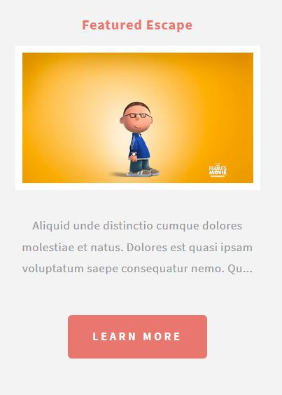

# Escape Velocity Theme

The **Escape Velocity** Theme is for [Grav CMS](http://github.com/getgrav/grav).  This README.md file should be modified to describe the features, installation, configuration, and general usage of this theme.

## Installation
### GPM Installation (Preferred)

The simplest way to install this theme is via the [Grav Package Manager (GPM)](http://learn.getgrav.org/advanced/grav-gpm) through your system's terminal (also called the command line).  From the root of your Grav install type:

    bin/gpm install escape-velocity

This will install the Escape Velocity theme into your `/user/themes` directory within Grav. Its files can be found under `/your/site/grav/user/themes/escape-velocity`.

### Manual Installation

To install this theme, just download the zip version of this repository and unzip it under `/your/site/grav/user/themes`. Then, rename the folder to `escape-velocity`. You can find these files on [GitHub](https://github.com/jgonyea/grav-theme-escape-velocity) or via [GetGrav.org](http://getgrav.org/downloads/themes).

### Post Installation
Enable the **Escape Velocity** theme, either via the Admin plugin at admin/themes or in the system.yaml file under pages.theme.
```
pages:
  theme: escape-velocity
```

Do not directly edit the escape-velocity.yaml file found in the theme folder. Copy the escape-velocity.yaml file to user/config/themes and edit the new file there.

## Features

* Theme Slogan (optional) - Used to add additional text to the site name at the top of the page.
* Contact Information - Complete the form and the contact information will display in the sidebar.
* Social Icons (optional) - Add the full URL to a social platform, and an icon/link will automatically display on the top of the page.

### Featured Pages
The latest three pages tagged with the category "featured" will automatically display in a mini-listing towards the foote with teaser images and summaries.  The current page, if featured, will not display in that listing.



## Future plans
* Add a page for all featured pages.
* Modular front page
* Sidebar pages (left and right)

## Credits
* This theme wouldn't be here without HTML5Up.net.  Many thanks to [AJ](aj@lkn.io) for creating the theme initially on that site.
